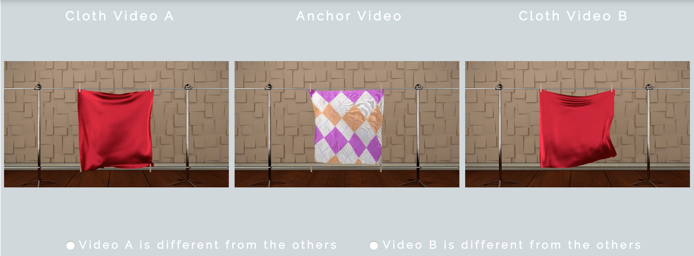
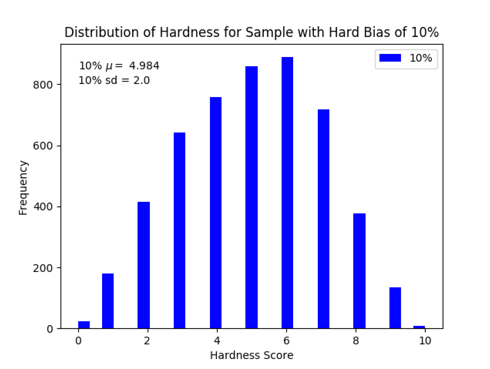
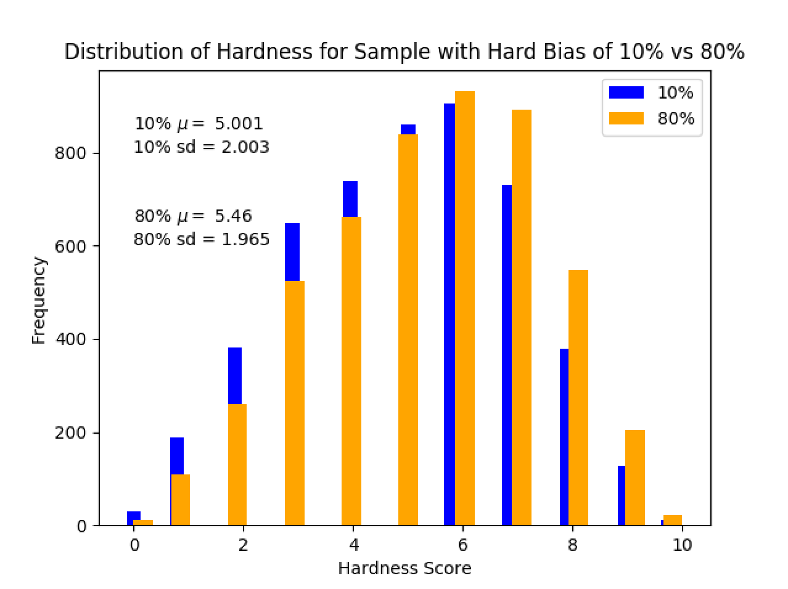
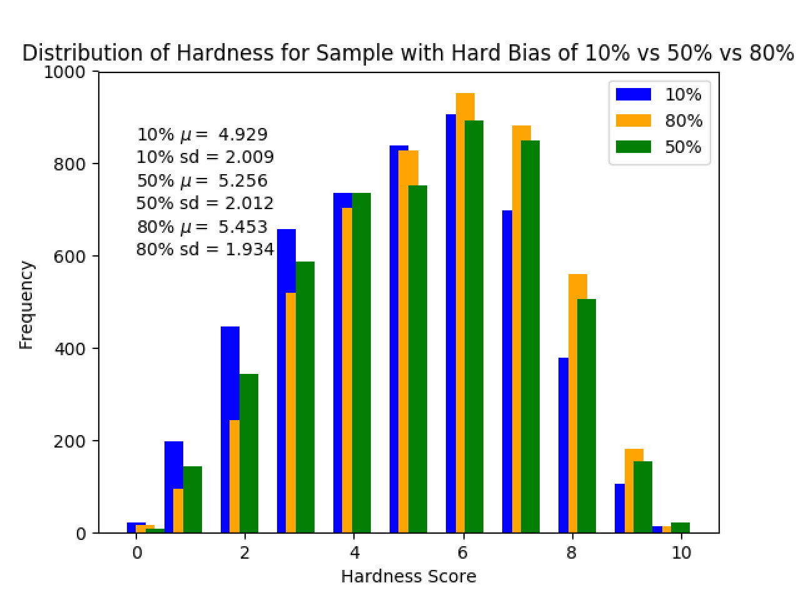

# Cloth Perception Experiment

<p align="center">

## Experimental Design

Using the parameters of stiffness (6 levels), mass (7 levels), texture (7 levels), and scene/wind (3 types), we generated 882 videos -- using all possible permutations of the parameters.

We will show the participant 3 videos per trial: an anchor video, a positive video with the same stiffness as the anchor, and a negative video with a different stiffness. Their task is to identify the negative.

<div class="DemoImage">
    <p align="center"></p>
</div>

## Sampling Method
From all the possible triplets, sampling.py takes a random sample of size ```k``` (500 trials for preliminary testing, later 3000-5000 trials).

The program also accepts another parameter ```pct_hard``` which is an integer from 1 to 100 to determine the 'hardness' of the sample. Each randomly sampled triplet is assigned a hardness score based on how difficult it is to determine the negative. For example: if the negative is 5 stiffness levels away from the positive and anchor, it is much easier to tell than if the negative is only 1 stiffness level away from the other two. It is also easier to differentiate the negative if all of the videos have a different scene, rather than if the negative shares a scene with the anchor and not with the positive, or with the positive and not the anchor. Using similar logic for the parameters of mass and texture, each triplet receives a score -- a higher score means the negative is more difficult to determine.

Thus, each randomly sampled triplet at index ```i``` is compared to the triplet at index ```i + 1```. Between the two of them, one is easier (lower score) and the other is harder (higher score). The program will sample the harder one ```pct_hard```% of the time, resulting in a Gaussian distribution of hardness scores within the sample that is skewed left/right to varying extent depending on ```pct_hard```.

<div class="Histograms">
    <p align="center">
    </p>
</div>

## Preparing for Participants
experiment_preparer.py runs sampling.py, breaks up the output into blocks (to save data periodically; current block size is 50 trials), and saves those blocks as individual CSV and JSON files. Each line in the CSV/JSON files contains the triplet index, the three file names for the anchor, positive, and negative, and the triplet's hardness score.

The web_display folder has the HTML, JavaScript, and CSS files that create an interface for the participant to actually complete the experiment, as well as a PHP file that stores their data.

### Folders
    * [json_files](json_files/): JSON files containing video file names and hardness scores for each block of data.
    * [visuals](visuals/): Images to demonstrate how the experiment works.
    * [web_display](web_display/): Contains JavaScript, HTML, PHP, and CSS code for displaying the website and saving the participant's data.
